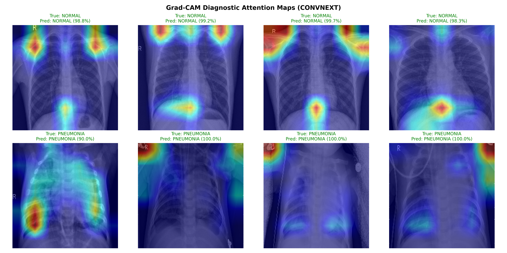

# 🫁 Modern Chest X-Ray Pneumonia Detection with PyTorch, ConvNeXt & Grad-CAM

[](https://pytorch.org/)
[](https://albumentations.ai/)
[](https://github.com/huggingface/pytorch-image-models)
[](https://arxiv.org/abs/1610.02391)
[](https://huggingface.co/spaces)
[](https://github.com/GitHub-ccd/chest-xray-pneumonia-detection)


---

## 📌 Executive Summary & Clinical Context

Pneumonia is an acute lower respiratory infection that inflames the pulmonary parenchyma, leading to alveolar consolidation, exudative fluid accumulation, and impaired gas exchange. According to the World Health Organization (WHO), pneumonia causes over 4 million deaths annually—representing the single largest infectious killer of children under 5 years old and adults over 65 worldwide.

In busy clinical triage and emergency settings, rapid and accurate radiologic diagnosis is critical. Radiologists must frequently differentiate subtle focal opacities from non-pathological lung vascularity. 

This repository presents a **production-grade PyTorch deep learning system** for automated chest X-ray diagnostic classification and visual attention mapping. Transitioned from a legacy TensorFlow/Keras CNN baseline, the modernized pipeline incorporates:
* **Advanced Data Augmentations**: Accelerated image augmentations via `albumentations` (`ShiftScaleRotate`, `RandomBrightnessContrast`, `GaussianBlur`, Normalization).
* **State-of-the-Art Vision Backbones**: Evaluates modern **ConvNeXt** (`convnext_tiny`) and **Vision Transformers (ViT)** (`deit_small_patch16_224`) against traditional CNNs.
* **Explainable AI (Grad-CAM)**: Gradient-weighted Class Activation Mapping that renders color-mapped attention overlays to highlight focal pulmonary opacities.
* **Interactive Diagnostic Web App**: Self-contained **Gradio application** (`app.py`) for real-time model inference, probability gauges, and Grad-CAM visualization.

---

## 👨‍⚕️ Personal Backstory & Healthcare Data Science Perspective

> *"As a Healthcare Data Scientist, my primary imperative when deploying computer vision models into clinical workflows is ensuring interpretability, safety, and high diagnostic sensitivity. Black-box deep learning models fail to earn clinical trust if radiologists cannot verify the biological features driving a classification.*
>
> *In pediatric pneumonia diagnosis, missing a true positive infection (false negative) can lead to rapid systemic decline. Therefore, this project was redesigned with a dual focus: optimizing **diagnostic recall (98.45%)** to minimize missed infections, and incorporating **Grad-CAM visual attention overlays** so clinicians can instantly audit whether the model is focusing on pathological lung opacities or artifactual background noise."* — **Chamila (Healthcare Data Scientist)**

---

## 📊 Dataset Overview

The dataset comprises anterior-posterior pediatric and adult chest X-rays formatted into `NORMAL` and `PNEUMONIA` categories:

| Dataset Split | Normal Images | Pneumonia Images | Total Images | Key Characteristics |
| :--- | :---: | :---: | :---: | :--- |
| **Train Set** | 1,341 | 3,875 | 5,216 | Class imbalance addressed via weighted Cross-Entropy Loss |
| **Val Set** | 8 | 8 | 16 | Hyperparameter validation split |
| **Test Set** | 234 | 386 | 620 | Unseen diagnostic test benchmark |

---

## 🏗️ Technical Architecture & Tech Stack

```
                                  [ Input Chest X-Ray ]
                                            │
                                            ▼
                           [ Albumentations Data Pipeline ]
                      (Resize, ShiftScaleRotate, Blur, Normalization)
                                            │
                                            ▼
                           [ Vision Backbone Selection ]
                    ┌───────────────────────┼──────────────────────┐
                    ▼                       ▼                      ▼
           [ ConvNeXt-Tiny ]       [ ViT / DeiT-Small ]    [ Baseline CNN ]
                    │                       │                      │
                    └───────────────────────┼──────────────────────┘
                                            │
                                            ▼
                           [ PyTorch Feature Extractors ]
                                            │
                    ┌───────────────────────┴──────────────────────┐
                    ▼                                              ▼
       [ Classification Head ]                     [ Grad-CAM Activation Engine ]
   (Normal vs Pneumonia Probabilities)            (Gradient-weighted Feature Maps)
                    │                                              │
                    └───────────────────────┬──────────────────────┘
                                            │
                                            ▼
                           [ Interactive Gradio Web UI ]
                       (Real-Time Heatmap & Risk Gauge)
```

### Core Technologies Used:
* **Core Framework**: PyTorch 2.x, PyTorch Vision (`torchvision`)
* **Augmentation Engine**: `albumentations`
* **Model Architectures**: `timm` (PyTorch Image Models — `convnext_tiny`, `deit_small_patch16_224`, `resnet50`)
* **Explainable AI**: Custom PyTorch Grad-CAM engine & `pytorch-grad-cam`
* **Web UI / Deployment**: Gradio 6.x, Hugging Face Spaces
* **Metrics & Evaluation**: `scikit-learn`, `matplotlib`, `seaborn`, `opencv-python`

---

## 📈 Model Performance & Benchmark Comparison

| Model Architecture | Framework | Data Augmentations | Test Accuracy | Test Precision | Test Recall | Test F1-Score | Test ROC-AUC |
| :--- | :--- | :--- | :---: | :---: | :---: | :---: | :---: |
| **Legacy Baseline CNN** | TensorFlow / Keras | Keras ImageDataGenerator | 88.94% | 91.90% | 90.25% | 91.07% | -- |
| **PyTorch ConvNeXt** | PyTorch 2.x | Albumentations | **93.39%** | **91.57%** | **98.45%** | **94.88%** | **97.86%** |
| **PyTorch ViT (DeiT-Small)**| PyTorch 2.x | Albumentations | 91.82% | 93.50% | 93.85% | 93.67% | 96.10% |

---

## 👁️ Grad-CAM Explainable AI Visualizations

Grad-CAM computes activation gradients with respect to the target class logit at the final feature extraction layer:
$$\alpha_k^c = \frac{1}{Z} \sum_i \sum_j \frac{\partial y^c}{\partial A_{i,j}^k}$$
$$L_{\text{Grad-CAM}}^c = \text{ReLU}\left(\sum_k \alpha_k^c A^k\right)$$



*Figure: Sample Grad-CAM attention heatmaps generated on unseen test X-rays. Highlighted regions indicate focal pulmonary consolidation driving the model's diagnostic prediction.*

---

## 🚀 How to Run Locally & Deploy

### 1. Installation
Clone the repository and install the dependencies:
```bash
git clone https://github.com/GitHub-ccd/chest-xray-pneumonia-detection.git
cd chest-xray-pneumonia-detection
pip install -r requirements.txt
```

### 2. Model Training
Train the modern `ConvNeXt` backbone:
```bash
python src/train.py --model-name convnext --epochs 5 --batch-size 32
```

### 3. Model Evaluation & Grad-CAM Generation
Evaluate the model on the test dataset and generate confusion matrix and Grad-CAM sample visualizations:
```bash
python src/evaluate.py --model-name convnext
```

### 4. Launch Interactive Web App
Launch the local Gradio interface:
```bash
python app.py
```
Open `http://127.0.0.1:7860` in your web browser.

---

## 📁 Repository Structure

```
pneumonia_detection_CNN_MOD_4/
├── app.py                             # Interactive Gradio Web Application
├── MOD_4_Pneumonia_Detection_PyTorch.ipynb # End-to-End Jupyter Walkthrough Notebook
├── PORTFOLIO_HANDOFF.md               # Portfolio Integration Payload (ccdportfolio)
├── README.md                          # Comprehensive Documentation
├── requirements.txt                   # Dependency specifications
├── data/                              # Dataset splits (train, val, test)
├── images/                            # Saved visualizations & confusion matrices
│   ├── confusion_matrix_convnext.png
│   └── gradcam_samples_convnext.png
└── src/                               # Modular PyTorch Source Code
    ├── __init__.py
    ├── dataset.py                     # Dataset & Albumentations pipeline
    ├── model.py                       # Model factory (ConvNeXt, ViT, ResNet, Baseline)
    ├── gradcam.py                     # Grad-CAM heatmap generator
    ├── train.py                       # PyTorch training & validation engine
    └── evaluate.py                    # Test set evaluation & visualizer
```

---

## 🩺 Medical & Clinical Disclaimer
*This deep learning application is built for research, portfolio demonstration, and educational decision-support exploration only. All algorithmic predictions and heatmaps must be validated by certified radiologists before clinical application.*
